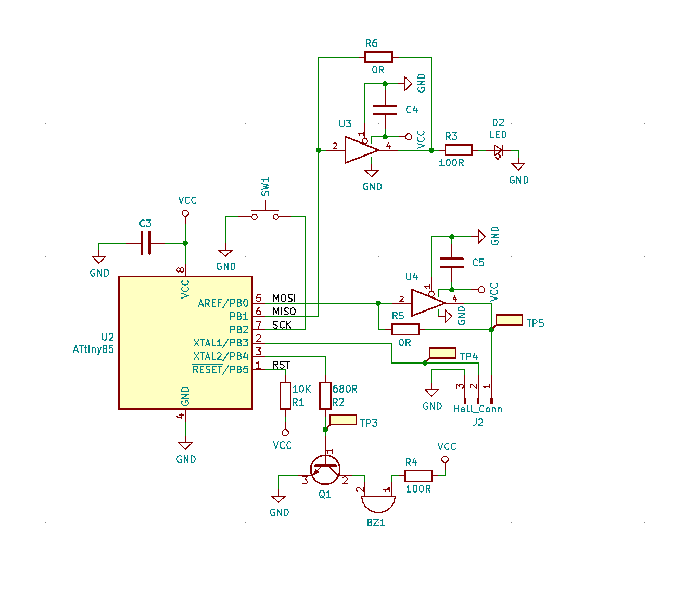
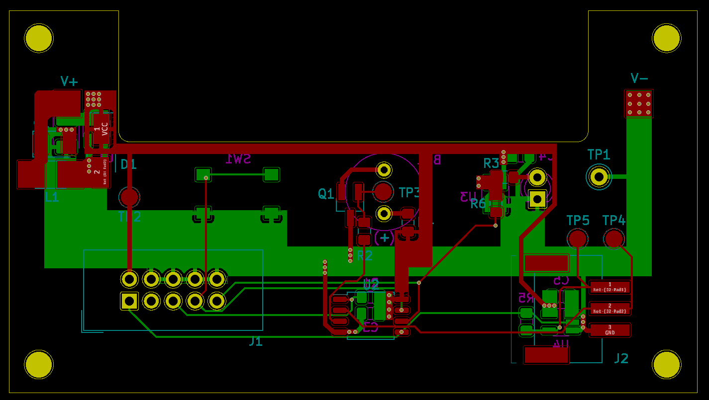
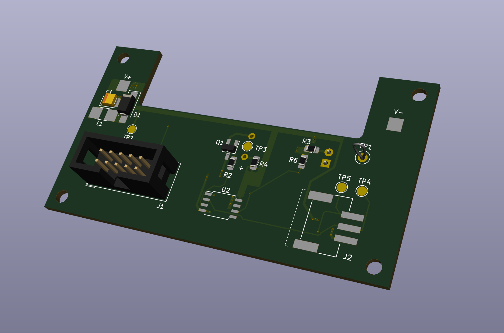
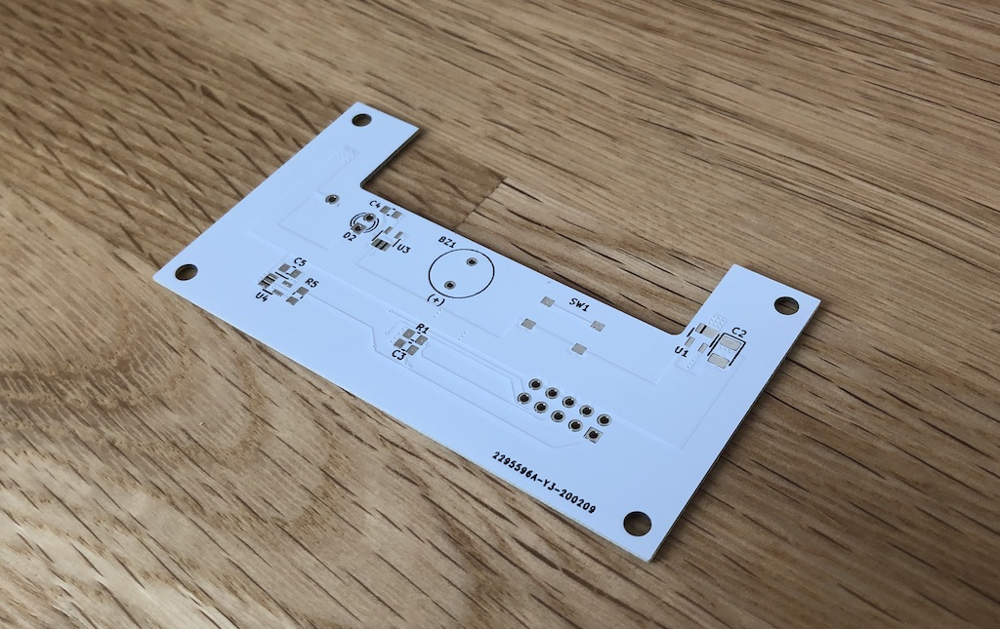
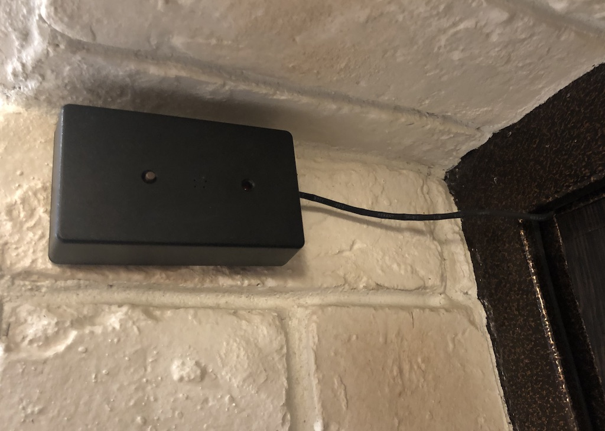

# HREM

This project contains firware code and KiCad schematics/PCB files for simple door latch reminder.

## The problem

Me and my wife forget to close our flat entrance door from time to time. What will you do about that? :)

This project is simple hardware solution to remind us about open door. It's not the simplest nor most elegant solution, but more like excuse for practicing skills in embedded software development and electrical engingeering.

## The solution

Solution is quite simple:

1. door latch has magnet on it's end;
1. hall effect sensor integrated into door frame right near latch with magnet;
1. μC powering up hall sensor once in a while and check magnet presense (hence door is closed);
1. buzzer goes on if latch is open.

## Part list

Complete BOM is in project files, but here are key parts used in a project:

1. [ATTiny85] as a μC
1. [Honeywell SS49][SS19] hall effect sensor;
1. [HT7733] as a voltage boost up controller. Single AAA battery is required.

## Building firmware

You need to have standart AVR toolchain is installed (e.g. `avr-gcc`, `avr-objcopy`...). Beyond that building firmware is as simple as:

```
$ make
```







[SS19]: https://eu.mouser.com/datasheet/2/187/SS49-1168552.pdf
[HT7733]: https://img.ozdisan.com/ETicaret_Dosya/349361_8060324.pdf
[attiny85]: https://ww1.microchip.com/downloads/en/DeviceDoc/Atmel-2586-AVR-8-bit-Microcontroller-ATtiny25-ATtiny45-ATtiny85_Datasheet.pdf